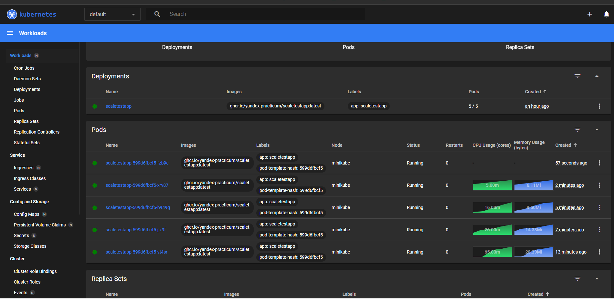
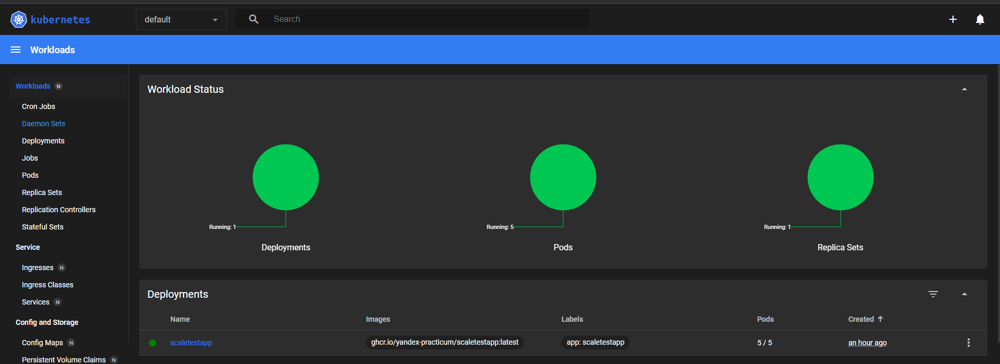
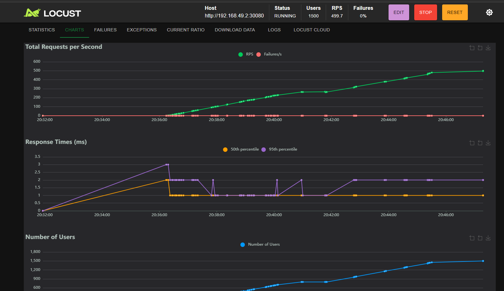
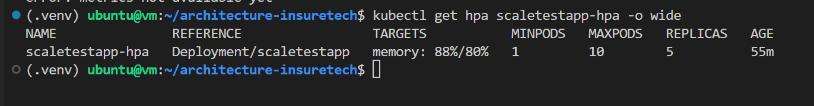
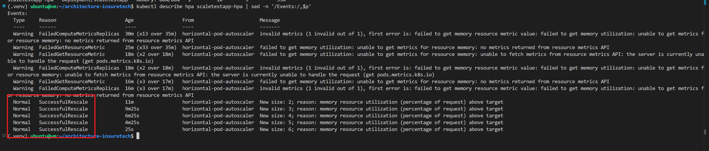
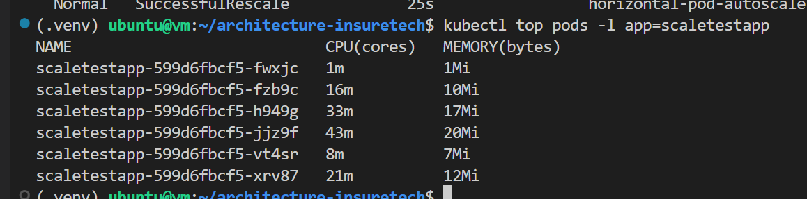

# Сдача проектной работы 8 спринта

## Задание 1. Проектирование технологической архитектуры

См. файлы в папке Task1:

- [`drawio`](<Task1/InureTech_технологическая архитектура_to-be.drawio>)
- [`svg-вариант`](<Task1/InureTech_технологическая архитектура_to-be.drawio.svg>)
- [`png-вариант`](<Task1/InureTech_технологическая архитектура_to-be.drawio.png>)

## Задание 2. Динамическое масштабирование контейнеров

Команды по запуску и настройке кластера с деплоем приложения представлены в [Makefile](Makefile).

Скрины, демонстрирующие успешный процесс автомасштабирования контейнеров:

### Веб-интерфейс minikube dashboard, демонстрирующий несколько под (pods):

### Веб-интерфейс minikube dashboard, демонстрирующий несколько под (workload):

### Веб-интерфейс locust, демонстрирующий рост нагрузки:

### Скрин статуса HPA (kubectl):

### Ивенты HPA, среди которых есть события "rescale" (kubectl):

### Поды (kubectl):

